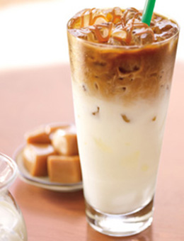
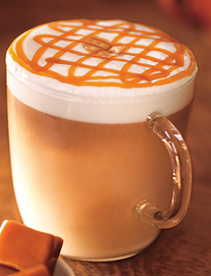

快速開始Bootstrap
===
## 初學者範本
```html
<!doctype html>
<html lang="en">
  <head>
    <!-- Required meta tags -->
    <meta charset="utf-8">
    <meta name="viewport" content="width=device-width, initial-scale=1, shrink-to-fit=no">

    <!-- Bootstrap CSS -->
    <link rel="stylesheet" href="https://stackpath.bootstrapcdn.com/bootstrap/4.1.1/css/bootstrap.min.css" integrity="sha384-WskhaSGFgHYWDcbwN70/dfYBj47jz9qbsMId/iRN3ewGhXQFZCSftd1LZCfmhktB" crossorigin="anonymous">

    <title>Hello, world!</title>
  </head>
  <body>
    <h1>Hello, world!</h1>

    <!-- Optional JavaScript -->
    <!-- jQuery first, then Popper.js, then Bootstrap JS -->
    <script src="https://code.jquery.com/jquery-3.3.1.slim.min.js" integrity="sha384-q8i/X+965DzO0rT7abK41JStQIAqVgRVzpbzo5smXKp4YfRvH+8abtTE1Pi6jizo" crossorigin="anonymous"></script>
    <script src="https://cdnjs.cloudflare.com/ajax/libs/popper.js/1.14.3/umd/popper.min.js" integrity="sha384-ZMP7rVo3mIykV+2+9J3UJ46jBk0WLaUAdn689aCwoqbBJiSnjAK/l8WvCWPIPm49" crossorigin="anonymous"></script>
    <script src="https://stackpath.bootstrapcdn.com/bootstrap/4.1.1/js/bootstrap.min.js" integrity="sha384-smHYKdLADwkXOn1EmN1qk/HfnUcbVRZyYmZ4qpPea6sjB/pTJ0euyQp0Mk8ck+5T" crossorigin="anonymous"></script>
  </body>
</html>
```
##小ICON圖示
[Font Awesome](https://fontawesome.com/)
在head標籤之內加入CSS語法
```html
<link rel="stylesheet" href="https://use.fontawesome.com/releases/v5.2.0/css/all.css" integrity="sha384-hWVjflwFxL6sNzntih27bfxkr27PmbbK/iSvJ+a4+0owXq79v+lsFkW54bOGbiDQ" crossorigin="anonymous">
```
##頂部區塊
###HTML :mega:
```html
<!-- 頂部區塊開始 -->
    <div class="header-user-info py-3" style="background-color: #944C0D;">
        <div class="container text-right">
            <a href="#" class="mr-3">
                <i class="fab fa-facebook-square fa-lg"></i>
            </a>
            <a href="#" class="mr-3">
                <i class="fab fa-instagram fa-lg"></i>
            </a>
            <a href="#">
                <i class="fab fa-line fa-lg"></i>
            </a>
        </div>
    </div>
<!-- 頂部區塊結束 -->>
```
###CSS :fire:
```css
.header-user-info a {
    color: rgb(255, 255, 255);
}

.header-user-info a:hover {
    color: #04BFBF;
    text-decoration: none;
}
```
##導覽列Navbar
###HTML :mega:
```html
<!-- 導覽列Navbar開始 -->
    <div class="header-navbar">
        <div class="container">
            <div class="row">
                <div class="col">
                    <nav class="navbar navbar-expand-lg navbar-light">
                        <a class="navbar-brand" href="#">
                            
                        </a>
                        <button class="navbar-toggler" type="button" data-toggle="collapse" data-target="#navbarSupportedContent" aria-controls="navbarSupportedContent"
                            aria-expanded="false" aria-label="Toggle navigation">
                            <span class="navbar-toggler-icon"></span>
                        </button>
                        <div class="collapse navbar-collapse" id="navbarSupportedContent">
                            <ul class="navbar-nav mr-auto">
                                <li class="nav-item active">
                                    <a class="nav-link" href="#">首頁
                                        <span class="sr-only">(current)</span>
                                    </a>
                                </li>
                                <li class="nav-item">
                                    <a class="nav-link" href="#">關於我們</a>
                                </li>
                                <li class="nav-item dropdown">
                                    <a class="nav-link dropdown-toggle" href="#" id="navbarDropdown" role="button" data-toggle="dropdown" aria-haspopup="true"
                                        aria-expanded="false">
                                        商品資訊
                                    </a>
                                    <div class="dropdown-menu" aria-labelledby="navbarDropdown">
                                        <a class="dropdown-item" href="#">飲品</a>
                                        <a class="dropdown-item" href="#">咖啡豆</a>
                                        <a class="dropdown-item" href="#">蛋糕</a>
                                        <a class="dropdown-item" href="#">麵包</a>
                                        <a class="dropdown-item" href="#">伴手禮</a>
                                    </div>
                                </li>
                                <li class="nav-item">
                                    <a class="nav-link" href="#">門市地圖</a>
                                </li>
                                <li class="nav-item">
                                    <a class="nav-link" href="#">聯絡我們</a>
                                </li>
                            </ul>
                        </div>
                    </nav>
                </div>
            </div>
        </div>
    </div>
<!-- 導覽列Navbar結束 -->
```
###CSS :fire:
```css
/*導覽列選單文字*/

#navbarSupportedContent a.nav-link {
    padding: 0 30px;
    font-size: 18px;
}

#navbarSupportedContent a:hover {
    color: #04BFBF;
}
```
##輪播Carousel
###HTML :mega:
```html
<!-- 輪播Carousel 開始 -->
    <header>
        <div id="carouselExampleIndicators" class="carousel slide" data-ride="carousel">
            <ol class="carousel-indicators">
                <li data-target="#carouselExampleIndicators" data-slide-to="0" class="active"></li>
                <li data-target="#carouselExampleIndicators" data-slide-to="1"></li>
                <li data-target="#carouselExampleIndicators" data-slide-to="2"></li>
            </ol>
            <div class="carousel-inner">
                <div class="carousel-item header-carousel-item bg-cover active" style="background-image:url(img/a01.jpg)">
                </div>
                <div class="carousel-item header-carousel-item bg-cover" style="background-image: url(img/a02.jpg)">
                </div>
                <div class="carousel-item header-carousel-item bg-cover" style="background-image: url(img/a03.jpg)">
                </div>
            </div>
            <a class="carousel-control-prev" href="#carouselExampleIndicators" role="button" data-slide="prev">
                <span class="carousel-control-prev-icon" aria-hidden="true"></span>
                <span class="sr-only">Previous</span>
            </a>
            <a class="carousel-control-next" href="#carouselExampleIndicators" role="button" data-slide="next">
                <span class="carousel-control-next-icon" aria-hidden="true"></span>
                <span class="sr-only">Next</span>
            </a>
        </div>
    </header>
<!-- 輪播Carousel 結束 -->
```
###CSS :fire:
```css
/*輪播*/

.bg-cover {
    background-size: cover;
    background-position: center center;
}
.header-carousel-item {
    height: 450px;
  }
```
##卡片疊Card(推薦商品)
###HTML :mega:
```html
<!-- 卡片疊Card(推薦商品) 開始 -->
    <section class="recommend">
        <div class="container">
            <div class="section-title">
                <h4>推薦商品</h4>
            </div>
            <div class="row justify-content-center">
                <div class="card-deck">
                    <div class="card">
                        
                        <div class="card-body">
                            <h5 class="card-title">晨曦黑咖啡</h5>
                        </div>
                        <div class="text-right">
                            <i class="fas fa-star"></i>
                            <i class="fas fa-star"></i>
                            <i class="fas fa-star"></i>
                            <i class="fas fa-star"></i>
                            <i class="fas fa-star"></i>
                        </div>
                    </div>
                    <div class="card">
                        
                        <div class="card-body">
                            <h5 class="card-title">冰焦糖瑪奇朵</h5>
                        </div>
                        <div class="text-right">
                            <i class="fas fa-star"></i>
                            <i class="fas fa-star"></i>
                            <i class="fas fa-star"></i>
                            <i class="fas fa-star"></i>
                            <i class="fas fa-star"></i>
                        </div>
                    </div>
                    <div class="card">
                        
                        <div class="card-body">
                            <h5 class="card-title">濃粹那堤</h5>
                        </div>
                        <div class="text-right">
                            <i class="fas fa-star"></i>
                            <i class="fas fa-star"></i>
                            <i class="fas fa-star"></i>
                            <i class="fas fa-star"></i>
                            <i class="fas fa-star"></i>
                        </div>
                    </div>
                    <div class="card">
                        
                        <div class="card-body">
                            <h5 class="card-title">焦糖瑪奇朵</h5>
                        </div>
                        <div class="text-right">
                            <i class="fas fa-star"></i>
                            <i class="fas fa-star"></i>
                            <i class="fas fa-star"></i>
                            <i class="fas fa-star"></i>
                            <i class="fas fa-star"></i>
                        </div>
                    </div>
                </div>
            </div>
        </div>
    </section>
<!-- 卡片疊Card(推薦商品) 結束 -->
```
###CSS :fire:
```css
/*內容標題*/
.section-title {
    margin-top: 160px;
    margin-bottom: 70px;
    position: relative;
    text-align: center;
}
```
##關於我們
<p>晨曦咖啡是全台唯一農場直營,並且產銷合一的連鎖咖啡品牌，我們的咖啡豆來自世界各國的,包含中南美洲、非洲、阿拉伯半島、亞洲等各個產區，晨曦咖啡始終堅持緩慢烘焙工藝,唯有如此才能確保咖啡豆發揮出它最天然的口感和香味</p>            
 <p>在咖啡豆的選取、儲存、混合、烘焙、研磨到咖啡的製作,所有步驟皆自主獨立完成，晨曦咖啡每一批咖啡豆,都是由頂級烘焙機及具十年以上烘焙經驗的烘焙大師所完成,每顆咖啡豆即是大師級的心血傑作</p>
<p>喝咖啡是件美好的事，晨曦咖啡希望除了將這份美好端至你手中外，也希望讓這份美好延伸回溯至源頭，所以晨曦建立公開透明化的商業網絡機制，讓消費者清楚追溯產品的來源，透過產區履歷讓消費者喝的安心 ，並鼓勵豆農使用永續的生產種植方式，尊重自然環境減少水土流失等災害發生</p>
###HTML :mega:
```html
 <!-- 關於我們 開始 -->
    <section>
        <div class="section-title">
            <h4>關於我們</h4>
        </div>
        <div class="container-fluid py-5 bg-light text-white" style="position: relative">
            <div class="row">
                <div class="col-md-5 bg-cover" style="
        position: absolute; top: 0; bottom: 0;
        background-image: url(img/aboutus.jpg)"></div>
            </div>
            <div class="container">
                <div class="row justify-content-end text-md-dark">
                    <div class="col-md-7">
                        <h4>從一顆生豆 ‧ 到一杯咖啡</h4>
                        <p>晨曦咖啡是全台唯一農場直營,並且產銷合一的連鎖咖啡品牌，我們的咖啡豆來自世界各國的,包含中南美洲、非洲、阿拉伯半島、亞洲等各個產區，晨曦咖啡始終堅持緩慢烘焙工藝,唯有如此才能確保咖啡豆發揮出它最天然的口感和香味
                        </p>
                        <p>在咖啡豆的選取、儲存、混合、烘焙、研磨到咖啡的製作,所有步驟皆自主獨立完成，晨曦咖啡每一批咖啡豆,都是由頂級烘焙機及具十年以上烘焙經驗的烘焙大師所完成,每顆咖啡豆即是大師級的心血傑作
                        </p>
                        <p>喝咖啡是件美好的事，晨曦咖啡希望除了將這份美好端至你手中外，也希望讓這份美好延伸回溯至源頭，所以晨曦建立公開透明化的商業網絡機制，讓消費者清楚追溯產品的來源，透過產區履歷讓消費者喝的安心 ，並鼓勵豆農使用永續的生產種植方式，尊重自然環境減少水土流失等災害發生
                        </p>
                    </div>
                </div>
            </div>
        </div>
    </section>
<!-- 關於我們 結束 -->
```
###CSS :fire:
```css
/*關於我們*/
@media (min-width: 768px) { 
    .text-md-dark{
        color: #333;
    }

 }
```

